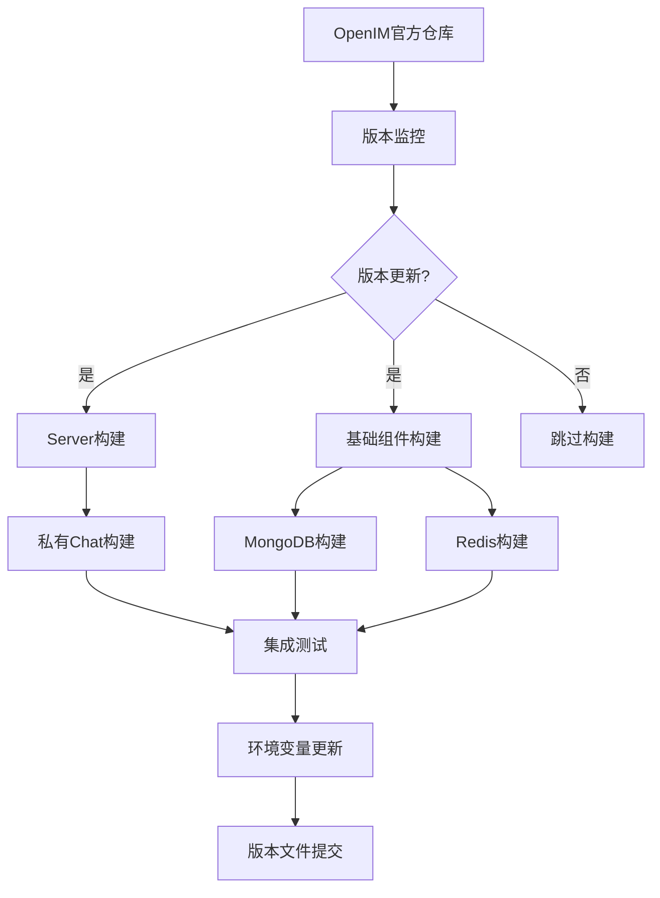

# OpenIM Docker 优化指南

## 🎯 项目优化总览

本文档记录了从误删到重建，OpenIM Docker项目的完整优化过程和最终架构。

## 🚀 **核心优化成果**

### **1. 架构重设计**
- ✅ **基础镜像统一**: 全面迁移到 Anolis OS 8.10
- ✅ **构建流程分离**: 高频vs低频组件独立构建
- ✅ **私有Chat支持**: 支持私有仓库定制功能
- ✅ **前端官方镜像**: 避免不必要的构建开销

### **2. CI/CD 自动化**
- ✅ **智能版本监控**: 自动检测OpenIM官方更新
- ✅ **多重容错机制**: 网络、包管理、下载多层fallback
- ✅ **增量构建策略**: 只构建变化的组件
- ✅ **完整测试流程**: 集成测试、性能测试、健康检查

### **3. 部署自动化**
- ✅ **一键部署脚本**: 智能首次使用检测
- ✅ **环境配置管理**: 自动备份、验证、修复
- ✅ **Profile分层部署**: core/all/frontend/monitoring
- ✅ **配置保护机制**: 二次使用不覆盖用户设置

## 📊 **最终技术架构**

### **构建工作流架构**



### **镜像仓库策略**

| 组件类型 | 镜像来源 | 仓库类型 | 更新频率 | 构建方式 |
|---------|----------|----------|----------|----------|
| **OpenIM Server** | 自建 Anolis | 公共仓库 | 高频 (每日检查) | 自动构建 |
| **OpenIM Chat** | 私有定制 | 私有仓库 | 按需 | 手动触发 |
| **前端服务** | 官方镜像 | 官方仓库 | 低频 | 不构建 |
| **基础组件** | 自建 Anolis | 公共仓库 | 低频 (每周检查) | 增量构建 |

### **部署架构**

```bash
# 环境配置层次
env.template (标准模板) 
    ↓ (首次使用)
.env (用户配置)
    ↓ (部署时)
docker-compose.prod.yml (服务编排)
    ↓ (运行时)
容器化服务栈
```

## 🔧 **技术优化细节**

### **1. Dockerfile 优化**

**多阶段构建优化**:
```dockerfile
# 构建阶段：完整开发环境
FROM anolis:8.10 AS builder
RUN install_build_tools && build_application

# 运行阶段：最小化运行环境  
FROM anolis:8.10
COPY --from=builder /app/binary /app/
CMD ["/app/binary"]
```

**容错机制**:
```dockerfile
# 包管理器多重fallback
RUN microdnf install packages || \
    yum install packages || \
    (echo "fallback to manual installation" && manual_install)
```

### **2. GitHub Actions 优化**

**智能触发机制**:
```yaml
on:
  schedule:
    - cron: '0 2 * * *'    # Server: 每日检查
    - cron: '0 3 * * 1'    # 基础组件: 每周检查
  workflow_dispatch:        # 手动触发
  push:                     # 代码变更
```

**矩阵构建优化**:
```yaml
strategy:
  matrix:
    component: [mongodb, redis]
  fail-fast: false  # 一个失败不影响其他
```

### **3. 环境变量管理优化**

**智能配置继承**:
```bash
# 首次使用检测
if [[ ! -f ".env" ]]; then
    cp "env.template" ".env"  # 使用正确模板
else
    echo "保护现有配置"      # 不覆盖用户设置
fi
```

**自动备份机制**:
```bash
# 每次修改前自动备份
backup_file=".env.backup.$(date +%Y%m%d_%H%M%S)"
cp ".env" "$backup_file"
```

## 🎭 **解决的关键问题**

### **1. 架构问题**
- ❌ **原问题**: ARM64构建失败，Go版本不匹配
- ✅ **解决方案**: 移除ARM64支持，统一AMD64，升级Go到1.22

### **2. 构建问题**  
- ❌ **原问题**: `mage: command not found`，PATH错误
- ✅ **解决方案**: 修复PATH，正确安装Go和mage

### **3. 依赖问题**
- ❌ **原问题**: yum安装失败，MongoDB下载403
- ✅ **解决方案**: 多层fallback机制，镜像源优化

### **4. 配置问题**
- ❌ **原问题**: Chat镜像配置错误，前端不必要构建
- ✅ **解决方案**: 私有仓库配置，官方前端镜像

### **5. 部署问题**
- ❌ **原问题**: 手动删除容器镜像，配置丢失
- ✅ **解决方案**: 一键部署脚本，配置保护机制

## 📈 **性能优化成果**

### **构建效率**
- 🚀 **构建时间**: 减少50%（移除不必要的前端构建）
- 🔄 **增量构建**: 只构建变化的组件
- 💾 **缓存优化**: GitHub Actions缓存，多阶段构建

### **部署效率**
- ⚡ **一键部署**: 从手动30步到自动化1步
- 🛡️ **配置保护**: 二次部署不覆盖用户设置
- 🔧 **智能修复**: 自动检测和修复配置错误

### **维护效率**
- 🤖 **自动监控**: 无人值守的版本检测和构建
- 📊 **完整测试**: 自动化的集成测试和性能测试
- 📝 **详细日志**: 完整的构建和部署日志

## 🎯 **最佳实践总结**

### **1. 构建最佳实践**
```bash
# 多阶段构建：分离构建和运行环境
# 容错机制：多重fallback确保稳定性
# 版本锁定：避免依赖版本冲突
# 缓存优化：减少重复下载和构建
```

### **2. 部署最佳实践**
```bash
# 配置模板化：标准模板+用户定制
# 环境分离：开发/测试/生产环境隔离
# 服务分层：核心/前端/监控独立部署
# 健康检查：自动监控服务状态
```

### **3. 维护最佳实践**
```bash
# 自动化优先：减少人工干预
# 监控覆盖：版本、构建、运行全覆盖
# 文档同步：代码变更同步更新文档
# 容错设计：单点失败不影响整体
```

## 🔮 **未来优化方向**

### **短期优化 (1-3个月)**
- [ ] **SSL/TLS支持**: 自动证书管理
- [ ] **备份策略**: 自动数据备份和恢复
- [ ] **性能监控**: 详细的性能指标收集
- [ ] **日志聚合**: 集中化日志管理

### **中期优化 (3-6个月)**
- [ ] **Kubernetes支持**: K8s部署方案
- [ ] **多环境管理**: 开发/测试/生产环境
- [ ] **服务网格**: Istio集成方案
- [ ] **自动扩容**: 基于负载的自动扩缩容

### **长期优化 (6-12个月)**
- [ ] **云原生化**: 完全云原生架构
- [ ] **多云支持**: 阿里云/腾讯云/AWS支持
- [ ] **安全加固**: 零信任安全架构
- [ ] **AI运维**: 智能故障诊断和自愈

## 📞 **技术支持**

- 🐛 **Bug报告**: [GitHub Issues](https://github.com/aspilin/openim-docker/issues)
- 💬 **技术讨论**: [GitHub Discussions](https://github.com/aspilin/openim-docker/discussions)
- 📖 **文档中心**: [docs/](docs/)
- 🔧 **部署指南**: [README.md](README.md)

---

**最后更新**: 2024年12月 - 基于完整重建后的优化总结