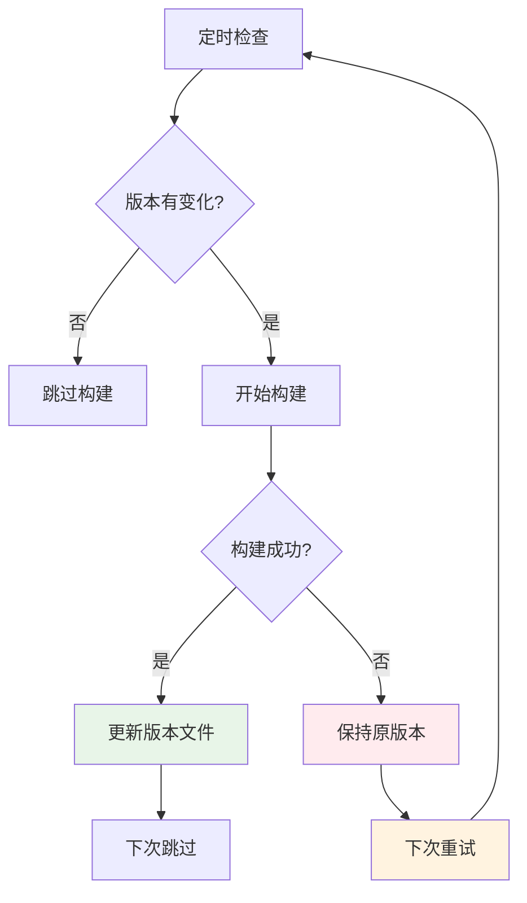

# 🛡️ 构建失败处理机制

## 🎯 **核心原则**

**✅ 构建成功才记录版本 - 确保版本文件的准确性**

我们的系统设计遵循一个重要原则：**只有在Docker镜像构建成功并推送到仓库后，才更新本地版本文件**。这样可以避免版本文件与实际镜像状态不一致的问题。

## 🔧 **技术实现**

### **工作流条件设计**

```yaml
# OpenIM Server 版本更新job
update-server-versions:
  needs: [check-server-updates, build-server]
  if: success() && needs.check-server-updates.outputs.should_build == 'true' && needs.build-server.result == 'success'

# 基础组件版本更新job  
update-base-versions:
  needs: [check-base-component-updates, build-base-components]
  if: success() && needs.check-base-component-updates.outputs.should_build == 'true' && needs.build-base-components.result == 'success'
```

### **安全条件解析**

| 条件 | 作用 | 说明 |
|------|------|------|
| `success()` | 整体成功检查 | 确保所有前置job都成功完成 |
| `should_build == 'true'` | 构建需求检查 | 确实需要构建新版本 |
| `build-job.result == 'success'` | 构建结果检查 | 明确验证构建job成功 |

## 📊 **不同场景的处理流程**

### **场景1: 正常构建成功**
```bash
🔍 检测新版本: v3.8.1
🚀 开始构建镜像
✅ 构建成功
📤 推送到阿里云
📝 更新版本文件: server=v3.8.1
✅ 提交到Git仓库
```

**结果**: 下次检查时版本一致，跳过构建

### **场景2: 构建失败**
```bash
🔍 检测新版本: v3.8.1
🚀 开始构建镜像
❌ 构建失败 (例如: wget命令未找到)
🚫 跳过推送步骤
🚫 不更新版本文件 (仍保持: server=v3.8.0)
🚫 不提交Git更改
```

**结果**: 下次检查时版本不一致，自动重试构建

### **场景3: 网络问题**
```bash
🔍 检测新版本: v3.8.1
🚀 开始构建镜像
✅ 构建成功
❌ 推送失败 (网络问题)
🚫 不更新版本文件 (仍保持: server=v3.8.0)
🚫 不提交Git更改
```

**结果**: 下次检查时重新构建并推送

### **场景4: 依赖问题**
```bash
🔍 检测新版本: v3.8.1
🚀 开始构建镜像
❌ 构建失败 (无法下载OpenIM源码)
🚫 跳过推送步骤
🚫 不更新版本文件 (仍保持: server=v3.8.0)
🚫 不提交Git更改
```

**结果**: 下次检查时自动重试，或需要手动修复

## 🔄 **自动重试机制**

### **重试触发条件**
1. **定时触发**: 每天UTC 2:00自动检查
2. **版本差异**: 官方版本 ≠ 本地记录版本
3. **手动触发**: GitHub Actions手动运行

### **重试策略**


## 🛠️ **故障诊断与修复**

### **检查构建状态**
```bash
# 1. 查看GitHub Actions状态
# 访问: https://github.com/你的用户名/openim-docker/actions

# 2. 检查版本文件
echo "当前记录的Server版本:"
cat server-versions.txt

echo "当前记录的基础组件版本:"
cat base-versions.txt

# 3. 检查官方最新版本
echo "官方最新Server版本:"
curl -s https://api.github.com/repos/openimsdk/open-im-server/releases/latest | jq -r .tag_name
```

### **手动修复方法**

#### **方法1: 强制重新构建**
```bash
# 删除版本文件，强制下次构建
rm server-versions.txt base-versions.txt
git add -A
git commit -m "强制重新构建所有镜像"
git push
```

#### **方法2: 重置到特定版本**
```bash
# 回退到已知工作的版本
echo "server=v3.8.0" > server-versions.txt
echo "mongodb=7.0.4" > base-versions.txt
echo "redis=7.2.3" >> base-versions.txt
git add *.txt
git commit -m "重置到稳定版本"
git push
```

#### **方法3: 跳过问题版本**
```bash
# 如果某个版本无法构建，直接跳过
echo "server=v3.8.2" > server-versions.txt  # 跳过v3.8.1
git add server-versions.txt
git commit -m "跳过有问题的版本v3.8.1"
git push
```

#### **方法4: 手动触发构建**
```bash
# 在GitHub Actions页面手动运行工作流
# 1. 访问Actions页面
# 2. 选择对应的工作流
# 3. 点击"Run workflow"
# 4. 选择参数并运行
```

## 📋 **常见构建失败原因**

### **1. Dockerfile问题**
```bash
❌ 错误示例:
RUN microdnf install -y ca-certificates tzdata curl bash

✅ 正确示例:
RUN microdnf install -y ca-certificates tzdata curl bash wget tar gzip
```

**解决方案**: 修复Dockerfile后推送到main分支触发重新构建

### **2. 网络连接问题**
```bash
❌ 典型错误:
curl: (6) Could not resolve host: github.com
```

**解决方案**: 等待网络恢复，系统会自动重试

### **3. API限制问题**
```bash
❌ 典型错误:
API rate limit exceeded
```

**解决方案**: 等待限制重置，或配置GitHub Token

### **4. 版本标签不存在**
```bash
❌ 典型错误:
fatal: Remote branch v3.8.1 not found
```

**解决方案**: 检查官方仓库是否真的发布了该版本

### **5. Docker镜像过大**
```bash
❌ 典型错误:
Error response from daemon: maximum size exceeded
```

**解决方案**: 优化Dockerfile，移除不必要的文件

## 📊 **监控与告警**

### **构建状态监控**
```bash
# 检查最近的构建状态
curl -s "https://api.github.com/repos/你的用户名/openim-docker/actions/workflows/build-openim-server.yml/runs?per_page=5" | jq '.workflow_runs[] | {conclusion, created_at, head_commit.message}'
```

### **版本一致性检查**
```bash
# 检查版本文件与实际镜像的一致性
RECORDED_VERSION=$(grep "server=" server-versions.txt | cut -d'=' -f2)
echo "记录的版本: $RECORDED_VERSION"

# 检查镜像是否真的存在
docker pull registry.cn-hangzhou.aliyuncs.com/aspirin2019/openim-server:${RECORDED_VERSION}-anolis
```

## 🎯 **最佳实践**

### **1. 定期检查**
- 每周检查一次构建状态
- 关注GitHub Actions的邮件通知
- 定期验证镜像可用性

### **2. 版本管理**
- 不要手动编辑版本文件，除非明确知道后果
- 保持版本文件与实际镜像状态一致
- 记录重要的版本变更原因

### **3. 故障处理**
- 优先修复根本原因而不是跳过版本
- 保留失败的构建日志以供分析
- 在修复后验证构建成功

### **4. 监控告警**
- 设置GitHub Actions的邮件通知
- 定期检查镜像仓库的空间使用情况
- 监控构建时间趋势，及时发现问题

## 🔐 **安全考虑**

### **版本文件保护**
- 版本文件只能通过成功的构建更新
- 避免在本地直接修改版本文件
- 所有版本变更都有Git历史记录

### **镜像安全**
- 只推送构建成功的镜像
- 使用安全的基础镜像（Anolis OS）
- 定期扫描镜像漏洞

### **权限管理**
- 限制对版本文件的直接修改权限
- 使用专用的服务账号进行镜像推送
- 定期轮换访问密钥

---

**这种机制确保了构建系统的可靠性和版本记录的准确性，即使在网络问题或构建错误的情况下也能正确处理！**

**最后更新**: 2024年12月 - 构建失败安全处理机制 