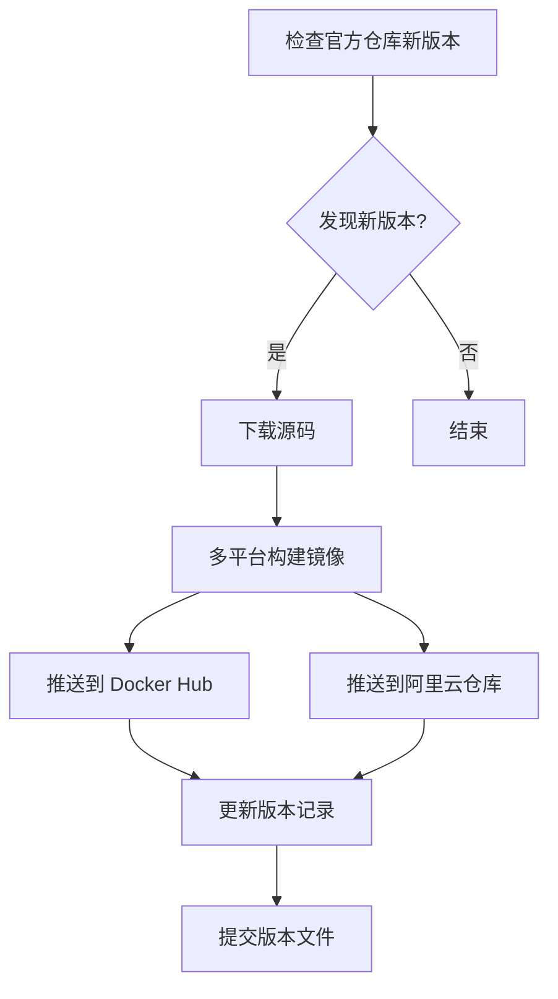

# OpenIM 自动构建指南 (Anolis OS 8.10)

## 📖 项目概述

本项目提供基于 **Anolis OS 8.10** 的 OpenIM Docker 镜像自动构建方案，通过 GitHub Actions 实现：

- 🤖 **自动监控**: 每天检查 OpenIM 官方仓库新版本
- 🔄 **自动构建**: 检测到新版本时自动构建 Anolis 镜像
- 📦 **双仓库推送**: 同时推送到 Docker Hub 和阿里云镜像仓库
- 🏗️ **多平台支持**: 构建 AMD64 和 ARM64 架构镜像
- 🛡️ **安全优化**: 非 root 用户、多阶段构建、健康检查

## 🎯 核心功能

### 自动构建的组件

| 组件 | 官方仓库 | 构建镜像 |
|------|---------|---------|
| OpenIM Server | `openimsdk/open-im-server` | `aspirin2019/openim-server:vX.X.X-anolis` |
| OpenIM Chat | `openimsdk/chat` | `aspirin2019/openim-chat:vX.X.X-anolis` |
| OpenIM Web | `openimsdk/openim-web` | `aspirin2019/openim-web:vX.X.X-anolis` |
| OpenIM Admin | `openimsdk/openim-admin` | `aspirin2019/openim-admin:vX.X.X-anolis` |

### 可选构建的基础组件

| 组件 | 基础镜像 | 构建镜像 |
|------|---------|---------|
| MongoDB | `openanolis/anolisos:8.10` | `aspirin2019/mongodb:latest-anolis` |
| Redis | `openanolis/anolisos:8.10` | `aspirin2019/redis:latest-anolis` |

## 🚀 快速开始

### 1. Fork 本仓库

```bash
# 访问 GitHub 页面 Fork 本仓库到您的账户
https://github.com/aspilin/openim-docker
```

### 2. 配置 GitHub Secrets

在您 Fork 的仓库中，进入 `Settings` → `Secrets and variables` → `Actions`，添加以下 Secrets：

#### 必需配置 (Docker Hub)
```
DOCKERHUB_USERNAME=aspirin2019
DOCKERHUB_TOKEN=your_docker_hub_personal_access_token
```

#### 可选配置 (阿里云镜像仓库)
```
ALIYUN_USERNAME=your_aliyun_username
ALIYUN_PASSWORD=your_aliyun_password
```

### 3. 获取 Docker Hub Token

1. 登录 [Docker Hub](https://hub.docker.com/)
2. 点击右上角头像 → `Account Settings`
3. 选择 `Security` → `New Access Token`
4. 输入 Token 名称，选择权限 `Read, Write, Delete`
5. 复制生成的 Token

### 4. 启用 GitHub Actions

Fork 后，GitHub Actions 默认是禁用的：

1. 进入您的仓库
2. 点击 `Actions` 标签页
3. 点击 `I understand my workflows, go ahead and enable them`

## ⚙️ 自动构建流程

### 触发条件

GitHub Actions 会在以下情况触发构建：

1. **定时检查**: 每天 UTC 2:00 自动检查新版本
2. **手动触发**: 在 Actions 页面手动运行工作流
3. **代码推送**: 推送到 `main` 分支时（仅构建相关文件变更）

### 构建流程



### 版本检测机制

工作流会监控以下官方仓库的 Release：

- `openimsdk/open-im-server` → 检测 OpenIM Server 新版本
- `openimsdk/chat` → 检测 OpenIM Chat 新版本  
- `openimsdk/openim-web` → 检测 Web 前端新版本
- `openimsdk/openim-admin` → 检测 Admin 后台新版本

版本信息存储在 `versions.txt` 文件中，只有检测到新版本时才会构建。

## 🏗️ 镜像特性

### 基于 Anolis OS 8.10 的优势

- **稳定性**: 企业级 Linux 发行版，长期支持
- **兼容性**: 与 CentOS/RHEL 高度兼容
- **安全性**: 定期安全更新，漏洞修复及时
- **性能**: 针对云原生场景优化

### 构建优化

- **多阶段构建**: 减小最终镜像体积
- **Go 1.21.5**: 使用最新稳定版 Go 编译器
- **非 root 用户**: 提高容器安全性
- **健康检查**: 内置服务健康检测
- **时区设置**: 默认使用 Asia/Shanghai 时区

## 📋 镜像标签说明

### 版本标签格式

- `aspirin2019/openim-server:v3.8.0-anolis` - 特定版本 + Anolis 标识
- `aspirin2019/openim-server:latest-anolis` - 最新版本 + Anolis 标识

### 平台支持

所有镜像支持以下平台：
- `linux/amd64` - Intel/AMD 64位处理器
- `linux/arm64` - ARM 64位处理器 (Apple M1/M2, ARM服务器)

## 🔧 手动触发构建

### 在 GitHub Actions 界面

1. 进入仓库的 `Actions` 页面
2. 选择 `Build OpenIM Images on Anolis OS 8.10` 工作流
3. 点击 `Run workflow` 下拉菜单
4. 可以指定特定版本或强制重建：
   - **OpenIM Server版本**: 指定要构建的 Server 版本
   - **OpenIM Chat版本**: 指定要构建的 Chat 版本
   - **强制重新构建**: 即使没有新版本也强制构建

### 使用 GitHub CLI

```bash
# 安装 GitHub CLI
curl -fsSL https://cli.github.com/packages/githubcli-archive-keyring.gpg | sudo dd of=/usr/share/keyrings/githubcli-archive-keyring.gpg
echo "deb [arch=$(dpkg --print-architecture) signed-by=/usr/share/keyrings/githubcli-archive-keyring.gpg] https://cli.github.com/packages stable main" | sudo tee /etc/apt/sources.list.d/github-cli.list > /dev/null
sudo apt update && sudo apt install gh

# 登录并触发构建
gh auth login
gh workflow run "Build OpenIM Images on Anolis OS 8.10" --repo your-username/openim-docker
```

## 📊 监控构建状态

### 查看构建日志

1. 进入 `Actions` 页面
2. 点击最新的工作流运行
3. 查看各个任务的详细日志：
   - `check-updates` - 版本检查
   - `build-server` - Server 镜像构建
   - `build-chat` - Chat 镜像构建
   - `build-web` - Web 镜像构建
   - `build-admin` - Admin 镜像构建

### 构建状态徽章

在 README 中已包含构建状态徽章，显示最新构建状态：

```markdown
[](https://github.com/aspilin/openim-docker/actions)
```

## 🎯 使用构建的镜像

### 拉取镜像

```bash
# 拉取最新版本
docker pull aspirin2019/openim-server:latest-anolis
docker pull aspirin2019/openim-chat:latest-anolis
docker pull aspirin2019/openim-web:latest-anolis
docker pull aspirin2019/openim-admin:latest-anolis

# 拉取特定版本
docker pull aspirin2019/openim-server:v3.8.0-anolis
docker pull aspirin2019/openim-chat:v1.7.0-anolis
```

### 在 docker-compose 中使用

```yaml
version: '3.8'
services:
  openim-server:
    image: aspirin2019/openim-server:latest-anolis
    container_name: openim-server
    restart: unless-stopped
    
  openim-chat:
    image: aspirin2019/openim-chat:latest-anolis
    container_name: openim-chat
    restart: unless-stopped
```

### 使用本项目的部署方案

```bash
# 克隆仓库
git clone https://github.com/aspilin/openim-docker.git
cd openim-docker

# 配置环境变量使用自动构建的镜像
cp env.example .env
# 编辑 .env 确保使用 aspirin2019 镜像

# 运行部署脚本
chmod +x scripts/deploy-anolis.sh
./scripts/deploy-anolis.sh
```

## 🔄 自定义构建配置

### 修改构建频率

编辑 `.github/workflows/build-openim-images.yml` 中的 cron 表达式：

```yaml
schedule:
  - cron: '0 2 * * *'  # 每天 UTC 2:00
  # - cron: '0 */6 * * *'  # 每6小时一次
  # - cron: '0 2 * * 1'    # 每周一检查
```

### 添加新的镜像仓库

在工作流中添加新的镜像仓库：

```yaml
- name: 推送到其他仓库
  run: |
    docker tag aspirin2019/openim-server:latest-anolis your-registry.com/openim-server:latest-anolis
    docker push your-registry.com/openim-server:latest-anolis
```

### 自定义构建参数

修改 Dockerfile 中的构建参数：

```dockerfile
# 使用不同的 Go 版本
RUN wget -O go.tar.gz https://golang.google.cn/dl/go1.22.0.linux-amd64.tar.gz

# 添加自定义标签
LABEL maintainer="your-email@example.com"
LABEL version="custom-build"
```

## 🚨 故障排查

### 常见构建失败原因

1. **Docker Hub 认证失败**
   ```
   Error: unauthorized: authentication required
   ```
   **解决**: 检查 `DOCKERHUB_USERNAME` 和 `DOCKERHUB_TOKEN` 是否正确

2. **网络超时**
   ```
   Error: failed to download source code
   ```
   **解决**: GitHub Actions 网络问题，重新运行工作流

3. **磁盘空间不足**
   ```
   Error: no space left on device
   ```
   **解决**: 工作流中已包含清理步骤，通常会自动解决

4. **权限问题**
   ```
   Error: permission denied
   ```
   **解决**: 检查 GitHub Token 权限，确保有仓库写入权限

### 调试方法

1. **启用调试日志**
   ```yaml
   env:
     ACTIONS_STEP_DEBUG: true
     ACTIONS_RUNNER_DEBUG: true
   ```

2. **查看详细构建日志**
   ```bash
   # 在构建步骤中添加
   docker build --progress=plain --no-cache -f Dockerfile .
   ```

3. **测试本地构建**
   ```bash
   # 在本地测试 Dockerfile
   git clone https://github.com/openimsdk/open-im-server.git
   cd open-im-server
   docker build -f ../dockerfiles/anolis/Dockerfile.openim-server .
   ```

## 📈 性能优化

### 构建缓存优化

GitHub Actions 已配置构建缓存：

```yaml
cache-from: type=gha
cache-to: type=gha,mode=max
```

### 并行构建

工作流采用并行构建策略：
- 4个组件同时构建
- 每个组件独立的构建任务
- 失败不影响其他组件构建

### 网络优化

- 使用中国镜像源加速下载
- Go 代理设置: `GOPROXY=https://goproxy.cn,direct`
- 容器镜像分层优化

## 📞 技术支持

- 🐛 **构建问题**: [GitHub Issues](https://github.com/aspilin/openim-docker/issues)
- 📖 **OpenIM 官方文档**: [docs.openim.io](https://docs.openim.io/)
- 💬 **社区讨论**: [OpenIM Discussions](https://github.com/openimsdk/open-im-server/discussions)

## 📄 许可证

本项目基于 Apache 2.0 许可证开源。详见 [LICENSE](LICENSE) 文件。

---

*最后更新: 2024年6月 - 专注于自动构建流程说明* 