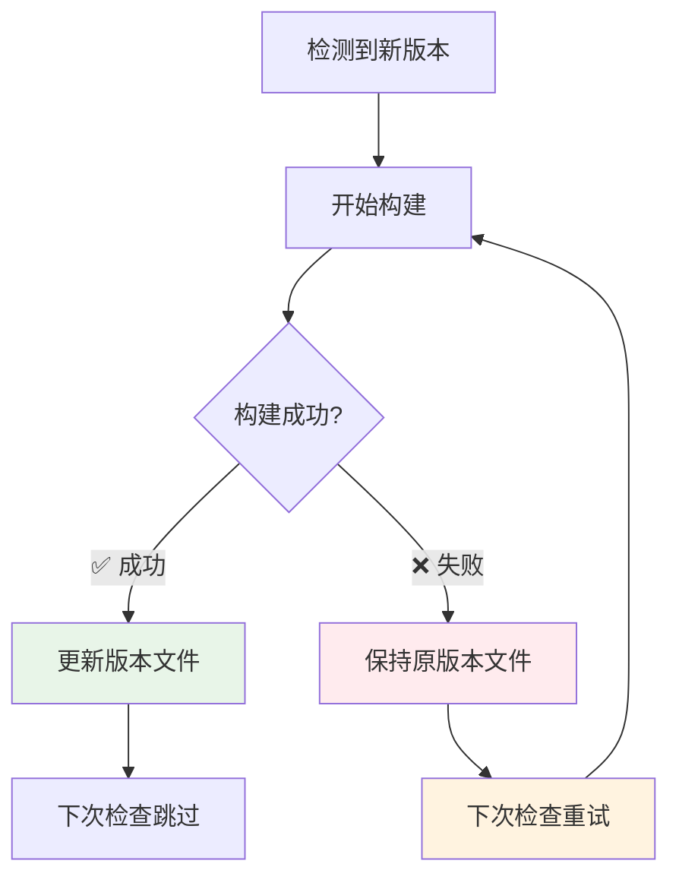
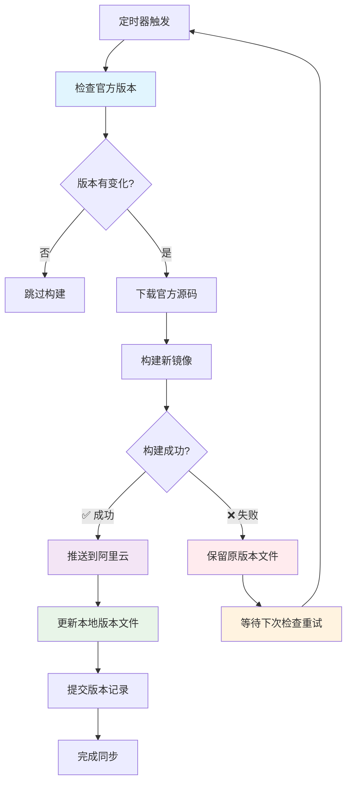

# 🔍 版本检测机制详解

## 📋 **问题回答**

**❓ 当前机制是如何判断需要构建升级的？是根据阿里云镜像版本来比较的吗？**

**✅ 答案：不是！** 我们的版本检测机制是基于**官方源头版本**与**本地记录版本**的比较，而不是与阿里云镜像版本比较。

**❓ 如果构建失败了，本地版本文件不会记录的吧？**

**✅ 答案：正确！** 我们采用了**构建成功后再更新版本**的安全机制，确保只有在构建成功时才记录版本。

## 🛡️ **安全版本记录机制**

### **关键原则：构建成功才记录版本**

```yaml
update-server-versions:
  needs: [check-server-updates, build-server]
  if: success() && needs.check-server-updates.outputs.should_build == 'true' && needs.build-server.result == 'success'
```

**安全条件**：
- ✅ `success()`: 所有前置job都成功
- ✅ `needs.build-server.result == 'success'`: 构建job明确成功
- ✅ `should_build == 'true'`: 确实需要构建

### **不同构建结果的版本文件处理**

| 构建状态 | 版本文件更新 | 下次检查结果 | 说明 |
|---------|-------------|-------------|------|
| ✅ **构建成功** | ✅ 更新版本文件 | ⏭️ 跳过构建 | 正常流程 |
| ❌ **构建失败** | ❌ 不更新版本文件 | 🔄 重新尝试构建 | 自动重试机制 |
| ⏹️ **构建跳过** | ❌ 不更新版本文件 | ⏭️ 跳过构建 | 版本无变化 |
| 🚫 **构建取消** | ❌ 不更新版本文件 | 🔄 重新尝试构建 | 手动取消重试 |

## 🎯 **版本检测机制总览**

我们采用的是**"源头追踪"**机制，直接监控OpenIM官方仓库的版本变化：

| 组件类型 | 版本来源 | 比较对象 | 触发条件 |
|---------|----------|----------|----------|
| **OpenIM Server** | GitHub API | 本地版本文件 | 官方新版本 ≠ 本地记录 |
| **MongoDB/Redis** | 官方docker-compose.yml | 本地版本文件 | 官方配置 ≠ 本地记录 |

## 🔄 **详细检测流程**

### **1. OpenIM Server 版本检测**

```bash
# 第1步：获取官方最新版本
curl -s https://api.github.com/repos/openimsdk/open-im-server/releases/latest | jq -r .tag_name
# 例如返回：v3.8.1

# 第2步：读取本地记录版本
grep "server=" server-versions.txt | cut -d'=' -f2
# 例如返回：v3.8.0

# 第3步：版本比较
if [[ "v3.8.1" != "v3.8.0" ]]; then
    echo "🚀 检测到新版本，触发构建！"
    SHOULD_BUILD=true
fi
```

**版本来源**：
- ✅ **GitHub Releases API**: `https://api.github.com/repos/openimsdk/open-im-server/releases/latest`
- ❌ **不是阿里云镜像版本**

## 🔥 **构建失败时的自动重试机制**

### **失败场景分析**

```bash
# 场景1: 网络问题导致构建失败
❌ 构建失败 → ❌ 版本文件不更新 → 🔄 下次检查时重新构建

# 场景2: 依赖包下载失败
❌ 构建失败 → ❌ 版本文件不更新 → 🔄 下次检查时重新构建

# 场景3: Dockerfile语法错误  
❌ 构建失败 → ❌ 版本文件不更新 → 🔄 需要修复后重新构建
```

### **智能重试策略**



## 🛠️ **故障排查与调试**

### **检查构建失败原因**
```bash
# 1. 查看GitHub Actions日志
# 在仓库的Actions页面查看失败的job详情

# 2. 检查版本文件状态
cat server-versions.txt
cat base-versions.txt

# 3. 手动测试构建
docker build -f dockerfiles/anolis/Dockerfile.openim-server .
```

### **强制重置版本文件**
```bash
# 如果版本文件被错误更新，可以手动重置
echo "server=v3.7.0" > server-versions.txt  # 回退到之前版本
git add server-versions.txt
git commit -m "重置版本文件，强制重新构建"
git push
```

### **跳过失败版本**
```bash
# 如果某个版本无法构建，可以跳过到下一个版本
echo "server=v3.8.1" > server-versions.txt  # 直接跳过到目标版本
git add server-versions.txt  
git commit -m "跳过有问题的版本"
git push
```

## 📊 **版本追踪示例（包含失败情况）**

### **实际构建历史**
```bash
# 时间线：
2024-12-01: v3.8.0 ✅ 构建成功 → 版本文件更新
2024-12-15: v3.8.1 ❌ 构建失败 → 版本文件不变，保持v3.8.0 
2024-12-16: v3.8.1 🔄 自动重试 → ✅ 构建成功 → 版本文件更新到v3.8.1
2024-12-20: v3.8.1 ⏭️ 无变化，跳过构建
2024-12-25: v3.8.2 ✅ 构建成功 → 版本文件更新到v3.8.2
```

### **失败重试示例**
```bash
# 构建失败日志：
❌ 2024-12-15 02:00: v3.8.1构建失败 (wget命令未找到)
📝 版本文件状态: server=v3.8.0 (未更新)
🔄 2024-12-16 02:00: v3.8.1重新构建 (Dockerfile已修复)
✅ 2024-12-16 02:15: v3.8.1构建成功
📝 版本文件状态: server=v3.8.1 (已更新)
⏭️ 2024-12-17 02:00: v3.8.1跳过构建 (版本一致)
```

## 📁 **本地版本记录机制**

### **版本文件作用**
```bash
# server-versions.txt - Server版本记录
server=v3.8.0

# base-versions.txt - 基础组件版本记录  
mongodb=7.0.4
redis=7.0.15
```

### **为什么不用阿里云镜像版本？**

| 对比维度 | 本地文件记录 | 阿里云镜像版本 |
|---------|-------------|---------------|
| **准确性** | ✅ 精确记录构建过的版本 | ❌ 需要API查询，可能失败 |
| **性能** | ✅ 本地读取，极快 | ❌ 网络请求，较慢 |
| **可控性** | ✅ 完全可控，可手动修改 | ❌ 依赖外部服务 |
| **调试** | ✅ 版本历史清晰 | ❌ 难以追踪变化 |
| **离线** | ✅ 离线也能工作 | ❌ 需要网络连接 |
| **构建状态** | ✅ 只记录成功构建的版本 | ❌ 无法反映构建状态 |

## 🎛️ **触发条件详解**

### **自动触发条件**
```yaml
# 1. 定时触发
schedule:
  - cron: '0 2 * * *'    # Server: 每天检查
  - cron: '0 3 * * 1'    # 基础组件: 每周一检查

# 2. 代码推送触发
push:
  paths:
    - 'dockerfiles/anolis/Dockerfile.*'
    - '.github/workflows/build-*.yml'

# 3. 版本差异触发
if [[ "${官方版本}" != "${本地记录版本}" ]]; then
    构建新镜像
fi
```

### **跳过构建的情况**
- ✅ 官方版本 = 本地记录版本
- ✅ 手动测试模式 (`test_build=true`)
- ✅ API获取失败且无有效默认版本
- ✅ 上次构建失败但官方版本未变化时（需要修复后手动触发）

## 🔄 **完整版本同步流程（含失败处理）**



## 🛠️ **手动调试命令**

### **检查当前版本状态**
```bash
# 检查Server版本
echo "官方最新版本:"
curl -s https://api.github.com/repos/openimsdk/open-im-server/releases/latest | jq -r .tag_name

echo "本地记录版本:"
grep "server=" server-versions.txt 2>/dev/null || echo "未找到版本文件"

# 检查基础组件版本
echo "官方MongoDB版本:"
curl -s https://raw.githubusercontent.com/openimsdk/open-im-server/main/docker-compose.yml | grep -A 10 "mongo:" | grep "image:"

echo "本地记录版本:"
cat base-versions.txt 2>/dev/null || echo "未找到版本文件"
```

### **强制触发构建**
```bash
# 方法1: 删除版本文件（下次检查时会触发构建）
rm -f server-versions.txt base-versions.txt

# 方法2: 手动修改版本文件
echo "server=v0.0.0" > server-versions.txt

# 方法3: GitHub Actions手动触发
# 在仓库的Actions页面点击"Run workflow"
```

## 🎯 **优势总结**

1. **🎯 精准追踪**: 直接监控官方源头，确保版本同步及时
2. **⚡ 高效检测**: 本地文件记录，避免重复网络请求
3. **🛡️ 容错机制**: API失败时有默认版本fallback
4. **📊 增量构建**: 只在版本真正变化时才构建
5. **🔍 可审计**: 完整的版本变更历史记录
6. **🛡️ 安全记录**: 只有构建成功才更新版本文件，避免错误状态
7. **🔄 自动重试**: 构建失败时自动在下次检查中重试

**这种机制确保我们的镜像始终与OpenIM官方保持同步，同时保证版本文件记录的准确性！**

---

**最后更新**: 2024年12月 - 基于源头追踪的智能版本检测 + 构建安全保障机制 