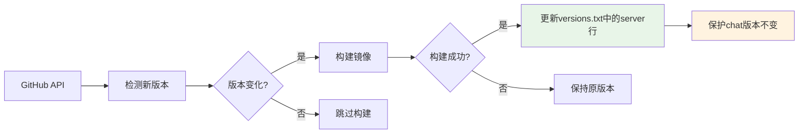
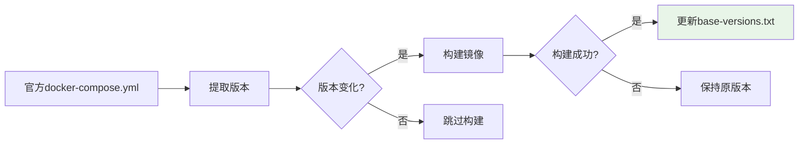

# 📁 版本文件结构详解

## 🎯 **版本文件概览**

我们的构建系统使用**2个独立的版本文件**来管理不同类型组件的版本：

```bash
📁 openim-docker/
├── versions.txt          # 主要组件版本（Server & Chat）
└── base-versions.txt     # 基础组件版本（MongoDB & Redis）
```

## 📄 **文件详解**

### **1. `versions.txt` - 主要组件版本**

```bash
📍 位置: /openim-docker/versions.txt
📄 格式:
server=v3.8.3-patch.4
chat=v1.8.4-patch.2
```

| 字段 | 说明 | 更新来源 | 更新频率 |
|------|------|----------|----------|
| `server` | OpenIM Server版本 | GitHub Releases API | 每天检查 |
| `chat` | OpenIM Chat版本 | 手动构建时更新 | 手动触发 |

**使用场景**：
- ✅ Server构建工作流读取/更新server版本
- ✅ Chat私有构建完成后可手动更新chat版本
- ✅ 部署脚本读取版本信息

### **2. `base-versions.txt` - 基础组件版本**

```bash
📍 位置: /openim-docker/base-versions.txt
📄 格式:
mongodb=7.0.4
redis=7.0.15
```

| 字段 | 说明 | 更新来源 | 更新频率 |
|------|------|----------|----------|
| `mongodb` | MongoDB版本 | 官方docker-compose.yml | 每周一检查 |
| `redis` | Redis版本 | 官方docker-compose.yml | 每周一检查 |

**使用场景**：
- ✅ 基础组件构建工作流读取/更新版本
- ✅ 确保与OpenIM官方推荐版本一致

## 🔄 **版本更新机制**

### **Server版本更新流程**


### **基础组件版本更新流程**


## 🛡️ **版本保护机制**

### **1. 跨版本保护**
```bash
# Server更新时保护Chat版本
# 更新前：
server=v3.8.0
chat=v1.8.4-patch.2

# 更新后：
server=v3.8.1    # ✅ 已更新
chat=v1.8.4-patch.2  # ✅ 保持不变
```

### **2. 构建失败保护**
```bash
# 如果Server构建失败：
❌ 构建失败 → versions.txt不变 → 下次重试

# 如果基础组件构建失败：
❌ 构建失败 → base-versions.txt不变 → 下次重试
```

### **3. 文件不存在保护**
```bash
# 如果版本文件不存在，自动创建：
echo "server=" > versions.txt
echo "mongodb=" > base-versions.txt
echo "redis=" >> base-versions.txt
```

## 📊 **版本文件操作示例**

### **读取版本信息**
```bash
# 获取Server版本
SERVER_VERSION=$(grep "server=" versions.txt | cut -d'=' -f2)
echo "当前Server版本: $SERVER_VERSION"

# 获取Chat版本
CHAT_VERSION=$(grep "chat=" versions.txt | cut -d'=' -f2)
echo "当前Chat版本: $CHAT_VERSION"

# 获取MongoDB版本
MONGODB_VERSION=$(grep "mongodb=" base-versions.txt | cut -d'=' -f2)
echo "当前MongoDB版本: $MONGODB_VERSION"

# 获取Redis版本
REDIS_VERSION=$(grep "redis=" base-versions.txt | cut -d'=' -f2)
echo "当前Redis版本: $REDIS_VERSION"
```

### **更新版本信息**
```bash
# 更新Server版本（保护Chat版本）
update_server_version() {
    local new_version=$1
    local chat_version=$(grep "chat=" versions.txt | cut -d'=' -f2 2>/dev/null || echo "")
    
    echo "server=$new_version" > versions.txt
    if [[ -n "$chat_version" ]]; then
        echo "chat=$chat_version" >> versions.txt
    fi
}

# 更新Chat版本（保护Server版本）
update_chat_version() {
    local new_version=$1
    local server_version=$(grep "server=" versions.txt | cut -d'=' -f2 2>/dev/null || echo "")
    
    if [[ -n "$server_version" ]]; then
        echo "server=$server_version" > versions.txt
    fi
    echo "chat=$new_version" >> versions.txt
}

# 更新基础组件版本
update_base_versions() {
    local mongodb_version=$1
    local redis_version=$2
    
    echo "mongodb=$mongodb_version" > base-versions.txt
    echo "redis=$redis_version" >> base-versions.txt
}
```

### **版本比较**
```bash
# 比较Server版本
compare_server_version() {
    local current=$(grep "server=" versions.txt | cut -d'=' -f2)
    local latest=$(curl -s https://api.github.com/repos/openimsdk/open-im-server/releases/latest | jq -r .tag_name)
    
    if [[ "$current" != "$latest" ]]; then
        echo "🚀 发现新版本: $current → $latest"
        return 0  # 需要更新
    else
        echo "✅ 版本已是最新: $current"
        return 1  # 无需更新
    fi
}
```

## 🔍 **故障排查**

### **检查版本文件状态**
```bash
# 检查文件是否存在
if [[ -f versions.txt ]]; then
    echo "✅ versions.txt 存在"
    cat versions.txt
else
    echo "❌ versions.txt 不存在"
fi

if [[ -f base-versions.txt ]]; then
    echo "✅ base-versions.txt 存在"
    cat base-versions.txt
else
    echo "❌ base-versions.txt 不存在"
fi
```

### **版本格式验证**
```bash
# 验证版本格式
validate_version_format() {
    local file=$1
    
    echo "🔍 验证 $file 格式..."
    
    # 检查是否有空行或格式错误
    if grep -E "^[a-z]+=$" "$file"; then
        echo "⚠️ 发现空版本值"
    fi
    
    # 检查是否有重复key
    if [ $(cut -d'=' -f1 "$file" | sort | uniq -d | wc -l) -gt 0 ]; then
        echo "⚠️ 发现重复的版本键"
    fi
    
    echo "✅ 格式检查完成"
}

validate_version_format versions.txt
validate_version_format base-versions.txt
```

### **手动修复版本文件**
```bash
# 重置为默认版本
reset_to_default_versions() {
    echo "🔄 重置到默认版本..."
    
    cat > versions.txt << EOF
server=v3.8.0
chat=v1.8.0
EOF
    
    cat > base-versions.txt << EOF
mongodb=7.0.4
redis=7.2.3
EOF
    
    echo "✅ 版本文件已重置"
}
```

## 📈 **版本历史追踪**

### **Git历史查看**
```bash
# 查看版本文件的提交历史
git log --oneline --follow versions.txt
git log --oneline --follow base-versions.txt

# 查看特定版本变更
git show HEAD:versions.txt
git diff HEAD~1 HEAD versions.txt
```

### **版本变更统计**
```bash
# 统计版本更新频率
git log --pretty=format:"%ad" --date=short versions.txt | sort | uniq -c
```

## 🎯 **最佳实践**

### **1. 版本文件管理**
- ✅ 不要手动编辑版本文件（除非紧急修复）
- ✅ 所有版本更新都通过工作流完成
- ✅ 定期备份版本文件状态
- ✅ 监控版本文件的Git提交

### **2. 版本保护策略**
- ✅ 构建成功才更新版本文件
- ✅ 更新时保护其他组件版本不变
- ✅ 版本文件格式验证
- ✅ 异常情况下的回滚机制

### **3. 监控与告警**
- ✅ 监控版本文件的异常变更
- ✅ 设置版本更新通知
- ✅ 定期验证版本文件与实际镜像的一致性

---

**这种版本文件设计确保了组件版本管理的独立性、安全性和可追溯性！**

**最后更新**: 2024年12月 - 双文件版本管理体系 